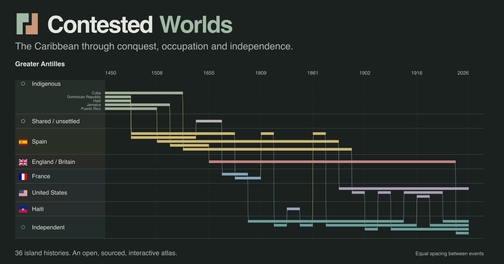

# Contested Worlds

An interactive atlas of the Caribbean through conquest, treaties, occupation and independence. Follow 36 island histories from 1450 to 2026, grouped either by island or by political power.



**Most contributions belong in the data.** Correct a date, add a source, or explain a disputed transition in [data/islands/](data/islands/). Each island is an ordinary, diffable JSON file; you do not need to edit the visualization.

- [Contribute a historical correction](CONTRIBUTING.md)
- [Editorial method and scope](data/methodology.md)
- [Deploy to GitHub Pages and connect a domain](documentation/deployment.md)
- [How shared URLs work](documentation/sharing-views.md)
- [Code structure and validation](documentation/architecture.md)

## Correct the data

Open the island file on GitHub, choose **Edit**, and propose a pull request. Use an existing citation from [data/sources.json](data/sources.json), or add one with a specific page or passage. Preserve existing event IDs. The automated checks run on your PR.

For a local check, only Python 3.10+ is needed:

```sh
npm run data:check
```

The compiler checks structure, dates, chronology, power IDs and citations. Historical accuracy still needs human judgment. Disputed dates and geographic limits should be explicit in the record, rather than silently resolved into false precision.

## Run the atlas

Requires Node 22.13+.

```sh
npm ci
npm run dev
```

When editing JSON while the server is running, use `npm run data:build` to refresh the runtime dataset.

| Command                | Purpose                                                                          |
| ---------------------- | -------------------------------------------------------------------------------- |
| `npm run data:check`   | Validate the editable research files without writing output                      |
| `npm test`             | Data, historical semantics, URL state, geometry, appearance and analytics checks |
| `npm run lint`         | Lint the entire application and its UI components                                |
| `npm run typecheck`    | Check TypeScript                                                                 |
| `npm run build`        | Export the static site to `docs/` for GitHub Pages                               |
| `npm run check:export` | Verify generated assets, metadata, image dimensions and deployment paths         |
| `npm run preview`      | Serve the exported site locally                                                  |
| `npm run social:build` | Rebuild the share card from actual Greater Antilles periods                      |

GitHub Actions checks data separately before checking the application and both static URL layouts. A push to `main` publishes through the Pages workflow after validation. First enable **Settings → Pages → GitHub Actions**; see the [deployment guide](documentation/deployment.md).

## What the chart means

**By Island** gives each island a row. **By Power** packs simultaneous holdings into separate lanes and connects successive periods. Colors identify powers. Vertical distance and rectangle thickness do not measure population, area, or importance.

Administration and sovereign title are distinct. Claims are annotations, not transfers of control. Time spacing measures elapsed years; event spacing gives equal gaps to relevant dates for the selected islands. The 1450 edge is a display boundary, not the beginning of Indigenous history. Flags are contemporary identifiers, not period reconstructions.

Hover for a period's explanation and sources; click to hold it. Copy the URL to share islands, options and a selected record. The atlas fits narrow screens, supports reduced motion and offers a linked chronology beside a selected island. It uses native SVG, system fonts and locally bundled data. There is no database or map service.

## Licenses and credits

Code and original interface assets: [MIT](LICENSE), © 2026 James Pearce. Original dataset prose and structure: [CC BY 4.0](data/LICENSE.md). Source publications retain their rights.

[SVG flags](public/flags/LICENSE) come from flag-icons (MIT). Coastlines come from Natural Earth (public domain); see [third-party credits](THIRD_PARTY_NOTICES.md). Google Analytics is optional and configured at build time; local previews do not send visits. [Deployment settings and privacy signals](documentation/deployment.md#analytics).
